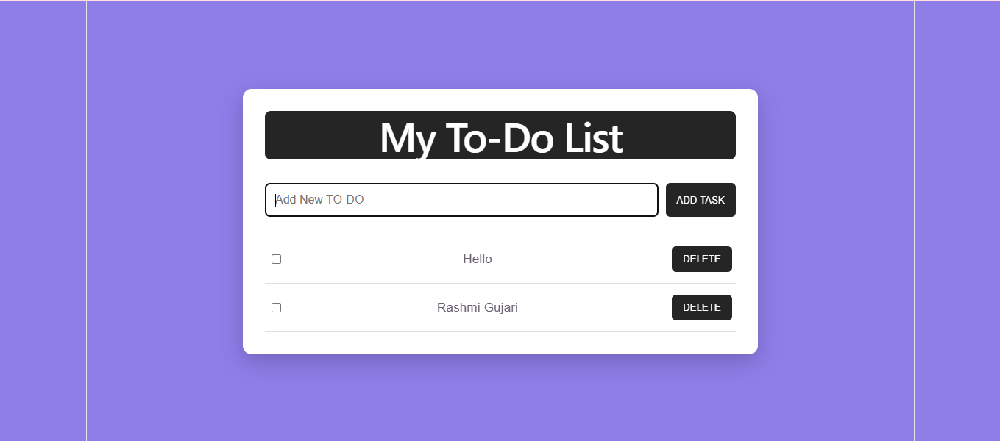
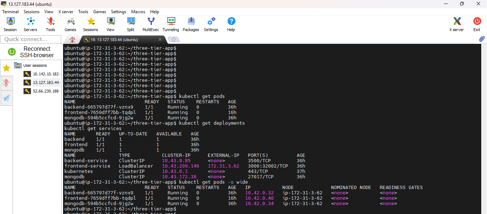

# 🚀 Three-Tier To-Do Application on Kubernetes

A full-stack Three-Tier To-Do Application deployed on an **AWS EC2 instance** using **Docker** and **K3s Kubernetes**.

The project demonstrates containerization, Kubernetes orchestration, persistent storage, secrets management, Nginx reverse proxy configuration, and troubleshooting of real deployment issues.

---
### Technologies

Docker | Kubernetes | K3s | AWS EC2 | React | Node.js | Express | MongoDB | Nginx | Git | GitHub

---

# 📌 Project Overview

This project implements a three-tier architecture:

1. **Presentation Tier** → React + Nginx
2. **Application Tier** → Node.js + Express
3. **Database Tier** → MongoDB

The complete application is deployed inside a **K3s Kubernetes cluster running on AWS EC2**.

---

# 🏗️ Architecture

```text
                         👤 USER
                            |
                            v
                   🌐 AWS EC2 Public IP
                            |
                            | HTTP :80
                            v
                 +----------------------+
                 |   React Frontend     |
                 |       Nginx          |
                 |      Port 80         |
                 +----------+-----------+
                            |
                            | /api/*
                            v
                 +----------------------+
                 |   Node.js Backend    |
                 |      Express         |
                 |      Port 3500       |
                 +----------+-----------+
                            |
                            | MongoDB
                            | Port 27017
                            v
                 +----------------------+
                 |       MongoDB        |
                 |                      |
                 |      PV / PVC        |
                 +----------------------+

                         ☸️ K3s
                    Kubernetes Cluster
                         AWS EC2
```

---

# 🛠️ Tech Stack

| Technology | Purpose                             |
| ---------- | ----------------------------------- |
| AWS EC2    | Cloud server / infrastructure       |
| Ubuntu     | Operating system                    |
| Docker     | Application containerization        |
| K3s        | Lightweight Kubernetes distribution |
| Kubernetes | Container orchestration             |
| React      | Frontend application                |
| Node.js    | Backend runtime                     |
| Express.js | REST API                            |
| MongoDB    | Database                            |
| Nginx      | Frontend web server & reverse proxy |
| Git        | Version control                     |
| GitHub     | Source code repository              |

---

# 📁 Project Structure

```text
three-tier-app/
│
├── backend/
│   ├── Dockerfile
│   ├── package.json
│   ├── package-lock.json
│   └── server.js
│
├── frontend/
│   ├── Dockerfile
│   ├── nginx.conf
│   ├── nginx.conf.k8s
│   ├── package.json
│   ├── package-lock.json
│   │
│   ├── public/
│   │
│   └── src/
│       ├── App.jsx
│       ├── App.css
│       ├── index.css
│       └── main.jsx
│
├── k8s/
│   ├── mongodb.yaml
│   └── backend.yaml
│
├── screenshots/
│   ├── frontend.png
│   └── kubernetes-pods.png
│
├── docker-compose.yml
├── .gitignore
└── README.md
```

---

# 🐳 Docker Implementation

Docker was used to containerize the application components.

## Backend Dockerfile

The Node.js backend was packaged into a Docker image.

```bash
cd ~/three-tier-app/backend

docker build -t three-tier-backend:latest .
```

Check the image:

```bash
docker images
```

---

# ⚛️ Frontend Docker Implementation

The React frontend uses a **multi-stage Docker build**.

### Stage 1

Node.js is used to install dependencies and create the production build.

```bash
npm ci
npm run build
```

### Stage 2

Nginx serves the generated React `dist` files.

The final container contains the production frontend rather than the complete Node.js development environment.

Build command:

```bash
cd ~/three-tier-app/frontend

npm run build

docker build -t three-tier-frontend:3.0 .
```

---

# 🌐 Nginx Reverse Proxy

Nginx serves the React frontend on port `80`.

API requests are forwarded to the backend:

```text
/api/*
    |
    v
Nginx
    |
    v
backend-service:3500
```

The important configuration is:

```nginx
location /api/ {
    proxy_pass http://backend-service:3500;
}
```

This allows the browser to communicate with the backend through the same frontend endpoint.

---

# ☸️ Kubernetes Implementation

K3s was used as the Kubernetes distribution on the AWS EC2 instance.

The application contains:

```text
Frontend Deployment
        |
        v
Frontend Pod
        |
        v
Nginx :80
        |
        v
Backend Service
        |
        v
Backend Pod
        |
        v
MongoDB
        |
        v
PV / PVC
```

---

# 🗄️ MongoDB Kubernetes Components

MongoDB was configured with:

* Kubernetes Secret
* PersistentVolumeClaim
* MongoDB Deployment
* MongoDB container
* Persistent database storage

The Secret stores MongoDB credentials.

Example:

```yaml
kind: Secret
metadata:
  name: mongodb-secret
```

The backend reads MongoDB credentials using Kubernetes `secretKeyRef`.

---

# 💾 Persistent Storage

MongoDB uses a Kubernetes **PersistentVolumeClaim (PVC)**.

The purpose is to make database storage persistent instead of depending only on the container filesystem.

```text
MongoDB Pod
     |
     v
   PVC
     |
     v
Persistent Storage
```

If the MongoDB container restarts, the database data can remain available through persistent storage.

---

# 🔐 Kubernetes Secrets

MongoDB credentials were moved away from hardcoded production values.

The repository contains a placeholder:

```yaml
password: CHANGE_ME
```

Actual credentials should not be committed to GitHub.

The backend accesses the credentials through:

```yaml
secretKeyRef:
  name: mongodb-secret
```

---

# 🚀 Deployment Flow

The overall deployment flow was:

```text
Developer
    |
    v
Source Code
    |
    v
React + Node.js + MongoDB
    |
    v
Docker Images
    |
    v
AWS EC2
    |
    v
K3s Kubernetes
    |
    +-------------------+
    |                   |
    v                   v
Frontend Pod       Backend Pod
    |                   |
    |                   v
    |               MongoDB Pod
    |                   |
    |                   v
    |                 PVC
    |
    v
Nginx
    |
    v
User
```

---

# 🔧 Important Commands Used

## Check Project

```bash
cd ~/three-tier-app

ls -la
```

---

## Git Repository

Initialize/check Git:

```bash
git status
git remote -v
```

Add files:

```bash
git add .
```

Commit:

```bash
git commit -m "Deploy three-tier application on Kubernetes"
```

Push:

```bash
git push -u origin main
```

---

# 🐳 Docker Commands

Build backend:

```bash
docker build -t three-tier-backend:latest ./backend
```

Build frontend:

```bash
docker build -t three-tier-frontend:3.0 ./frontend
```

Check images:

```bash
docker images
```

---

# ☸️ Kubernetes Commands

Check pods:

```bash
kubectl get pods
```

Detailed pod information:

```bash
kubectl describe pod <pod-name>
```

Check deployments:

```bash
kubectl get deployments
```

Check services:

```bash
kubectl get services
```

Check deployment image:

```bash
kubectl describe deployment frontend
```

Check container logs:

```bash
kubectl logs <pod-name>
```

Check rollout:

```bash
kubectl rollout status deployment/frontend
```

---

# 🔄 Updating Frontend Image

After modifying the React frontend:

```bash
npm run build
```

Then build a new Docker image:

```bash
docker build -t three-tier-frontend:3.0 .
```

Save the image:

```bash
docker save three-tier-frontend:3.0 -o /tmp/frontend-3.0.tar
```

Import the image into K3s:

```bash
sudo k3s ctr images import /tmp/frontend-3.0.tar
```

Verify:

```bash
sudo k3s ctr images list | grep three-tier-frontend
```

---

# 🔥 Kubernetes ImagePull Problem

One of the major issues during deployment was:

```text
ErrImagePull
ImagePullBackOff
```

The pod tried to pull:

```text
three-tier-frontend:2.0
```

Kubernetes interpreted the image as:

```text
docker.io/library/three-tier-frontend:2.0
```

But the image existed only locally on the EC2 machine and was not available in Docker Hub.

The error was:

```text
pull access denied
repository does not exist or may require authorization
```

### Solution

The Docker image was exported:

```bash
docker save three-tier-frontend:2.0 -o /tmp/frontend-2.0.tar
```

Then imported into K3s:

```bash
sudo k3s ctr images import /tmp/frontend-2.0.tar
```

Verified:

```bash
sudo k3s ctr images list | grep three-tier-frontend
```

Then Kubernetes was configured to use the locally available image:

```yaml
imagePullPolicy: Never
```

This prevented Kubernetes from trying to pull the image from Docker Hub.

---

# 🔥 Nginx Backend DNS Problem

Another major issue occurred after the frontend container started.

The pod logs showed:

```text
host not found in upstream "three-tier-backend"
```

The problem was that Nginx was configured with:

```nginx
proxy_pass http://three-tier-backend:3500;
```

But the Kubernetes backend Service was named:

```text
backend-service
```

Therefore Nginx could not resolve:

```text
three-tier-backend
```

### Fix

The configuration was changed to:

```nginx
proxy_pass http://backend-service:3500;
```

Then a new frontend image was created:

```bash
docker build -t three-tier-frontend:3.0 .
```

The image was exported:

```bash
docker save three-tier-frontend:3.0 -o /tmp/frontend-3.0.tar
```

Imported into K3s:

```bash
sudo k3s ctr images import /tmp/frontend-3.0.tar
```

Verified:

```bash
sudo k3s ctr images list | grep three-tier-frontend
```

This fixed the Nginx startup problem.

---

# 🧪 Troubleshooting Commands

Check frontend logs:

```bash
kubectl logs frontend-7448b4f57-qtq4x
```

Check pod events:

```bash
kubectl describe pod frontend-7448b4f57-qtq4x
```

Check all pods:

```bash
kubectl get pods -o wide
```

Check frontend deployment:

```bash
kubectl describe deployment frontend
```

Check backend service:

```bash
kubectl get services
```

---

# ⚠️ Challenges Faced

## 1. MongoDB Connection Issue

Initially MongoDB authentication was not working correctly.

The MongoDB connection string required the correct authentication configuration:

```text
authSource=admin
```

The username and password also had to match the Kubernetes Secret.

---

## 2. Frontend → Backend 404 Issue

The frontend initially received `404` responses from backend API requests.

The issue was related to the backend URL configuration.

The solution was to use Nginx as a reverse proxy and route:

```text
/api/*
```

to:

```text
backend-service:3500
```

---

## 3. Kubernetes ErrImagePull

Kubernetes tried to pull the locally built image from Docker Hub.

Solution:

```bash
docker save
```

followed by:

```bash
sudo k3s ctr images import
```

and:

```yaml
imagePullPolicy: Never
```

---

## 4. Nginx DNS Resolution Error

Nginx could not resolve:

```text
three-tier-backend
```

because the actual Kubernetes Service was:

```text
backend-service
```

The Nginx configuration was corrected accordingly.

---

## 5. Frontend Container Restart

After fixing the image issue, the frontend container initially entered an `Error` state.

The logs were checked using:

```bash
kubectl logs <frontend-pod>
```

The logs revealed the Nginx upstream DNS problem.

This demonstrated the importance of checking container logs instead of only checking whether the pod was scheduled.

---

# 📸 Screenshots

## Frontend Application



The screenshot shows the deployed React frontend application.

---

## Kubernetes Pods



The screenshot shows the Kubernetes workloads running on the K3s cluster.

---

# ▶️ How to Run

Clone the repository:

```bash
git clone https://github.com/rashmigujuri14/three-tier-app.git
```

Enter the project:

```bash
cd three-tier-app
```

### Backend

```bash
cd backend
npm install
```

### Frontend

```bash
cd ../frontend
npm install
npm run build
```

### Kubernetes

Apply the Kubernetes resources:

```bash
kubectl apply -f k8s/mongodb.yaml
kubectl apply -f k8s/backend.yaml
```

Check resources:

```bash
kubectl get pods
kubectl get services
kubectl get deployments
```

---

# 📊 Final Kubernetes Architecture

```text
                         AWS EC2
                            |
                            v
                         K3s
                            |
          +-----------------+-----------------+
          |                 |                 |
          v                 v                 v
   Frontend Pod       Backend Pod       MongoDB Pod
          |                 |                 |
          v                 v                 v
       Nginx             Express             MongoDB
       :80                :3500              :27017
          |                 |                 |
          +------ /api -----+                 |
                            |                 |
                            +-----------------+
                                      |
                                      v
                                     PVC
                                      |
                                      v
                               Persistent Storage
```

---

# 🎯 Key Learning Outcomes

Through this project, I gained hands-on experience with:

* AWS EC2 deployment
* Docker containerization
* Multi-stage Docker builds
* React production builds
* Nginx configuration
* Reverse proxy configuration
* Kubernetes Deployments
* Kubernetes Services
* Kubernetes Secrets
* PersistentVolumeClaims
* K3s
* Container image management
* Kubernetes troubleshooting
* Pod logs and events
* Git and GitHub
* Application deployment and debugging

---

# 💡 Interview Explanation

### What did you build?

I built and deployed a three-tier To-Do application on an AWS EC2 instance using Docker and K3s Kubernetes.

The frontend is built with React and served through Nginx. The backend is built using Node.js and Express, and MongoDB is used as the database.

### How does the request flow?

```text
User
 ↓
AWS EC2
 ↓
Nginx / React
 ↓
/api/*
 ↓
Backend Service
 ↓
Node.js / Express
 ↓
MongoDB
 ↓
Persistent Storage
```

### What was the most important troubleshooting experience?

One important issue was `ErrImagePull`.

The frontend image existed locally on the EC2 server, but Kubernetes attempted to pull it from Docker Hub.

I solved it by exporting the Docker image with:

```bash
docker save
```

and importing it into the K3s container runtime with:

```bash
sudo k3s ctr images import
```

I then configured:

```yaml
imagePullPolicy: Never
```

Another issue was an Nginx DNS error because the upstream name did not match the Kubernetes Service name. I corrected the Nginx configuration from `three-tier-backend` to `backend-service`.

---

# 🔗 GitHub

**Repository:**

https://github.com/rashmigujuri14/three-tier-app

---

# 👩‍💻 Author

**Rashmi Gujuri**

DevOps / Cloud Enthusiast

Built as a hands-on DevOps and Kubernetes learning project.

---
